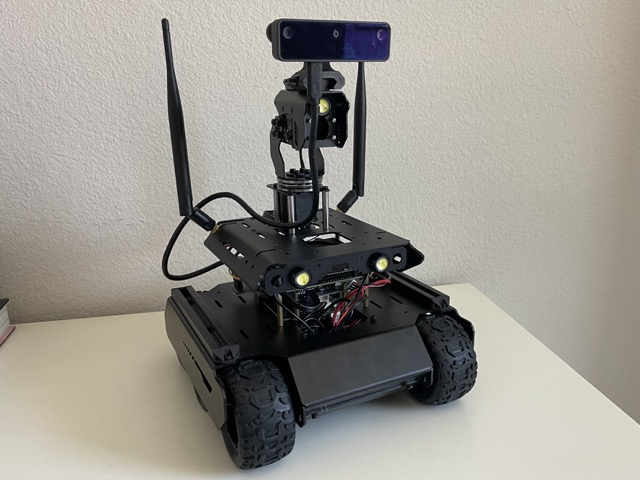

 

  

# Waveshare UGV Robot


## Custom Battery Configuration:
- 2x 3s LiPo batteries in parallel
    - OVONIC Lipo Battery 5200mAh 50C 11.1V 3S RC Battery with Deans and XT60
- Single battery dimensions (mm): 132 x 25 x 42


## Description
This repository contains the program running on the upper computer, which is a NVIDIA Jetson Orin Nano 8GB.

The upper computer communicates with the lower computer (the robot's driver based on ESP32) by sending JSON commands via GPIO UART. The host controller handles AI vision and strategy planning, while the sub-controller, utilizing an ESP32, manages motion control and sensor data processing. This setup ensures efficient collaboration and enhanced performance.

## Install

After cloning the repository, run the following command to install the required packages:
```
sudo ./setup.sh
```

Next, build the python virtual environment, activate it, and install dependencies:
```
python -m venv ugv-env

source ugv-env/bin/activate

pip install -r requirements.txt
```

Next, check the NumPy version:
```
pip list | grep numpy
```
It will likely display 2.0.0, we need to downgrade to 1.24.6 due to compatibility issues.
```
pip uninstall numpy

python -m pip install 'numpy==1.24.6'
```

Next, add user to the dialout group to allow access to the serial port:
```
sudo usermod -a -G dialout $USER
```

Reboot the system to apply the changes:
```
sudo reboot
```